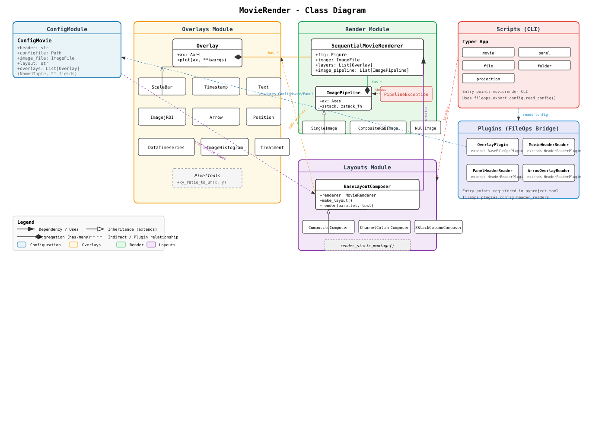
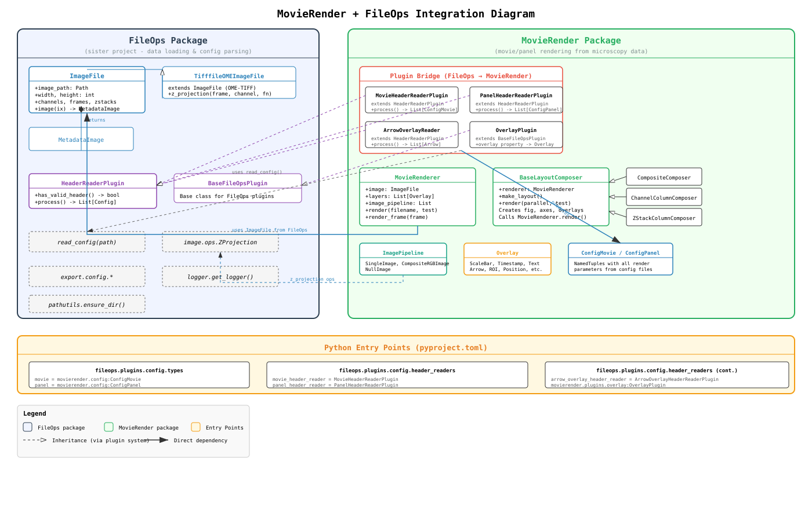
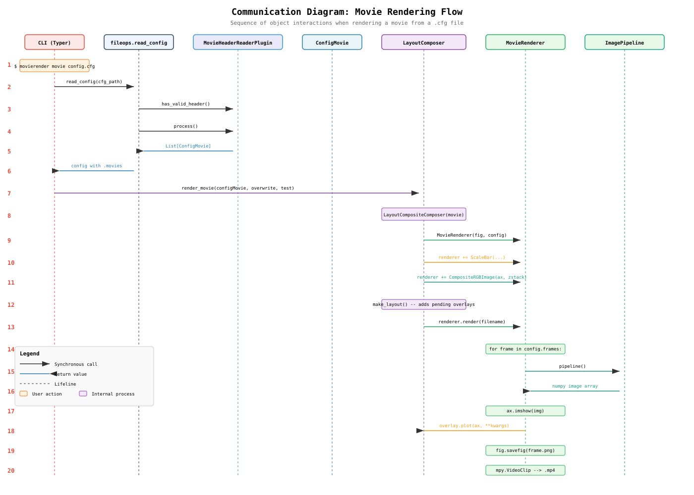
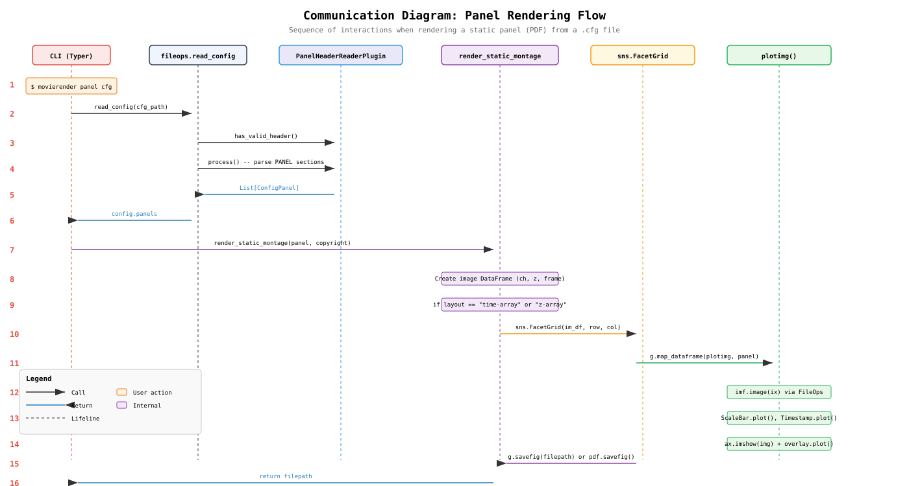
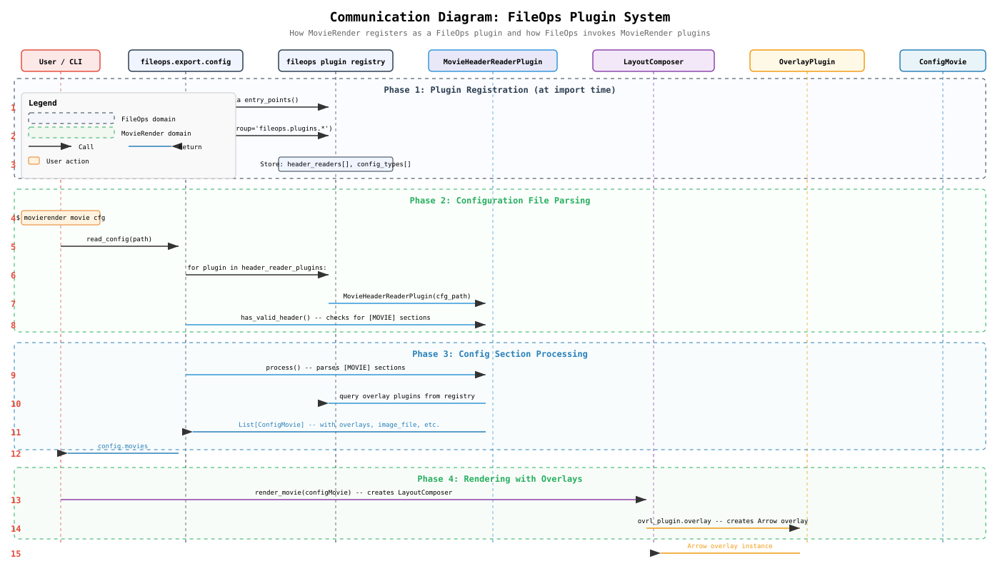

# MovieRender - Design Notes

## Table of Contents

- [Overview](#overview)
- [Architecture](#architecture)
- [Module Breakdown](#module-breakdown)
  - [Configuration Module](#configuration-module)
  - [Render Module](#render-module)
  - [Overlays Module](#overlays-module)
  - [Layouts Module](#layouts-module)
  - [Panel Module](#panel-module)
  - [Scripts Module](#scripts-module)
  - [Plugins Module](#plugins-module)
- [FileOps Integration](#fileops-integration)
- [Class Diagrams](#class-diagrams)
- [Communication Diagrams](#communication-diagrams)
- [Dependencies](#dependencies)

---

## Overview

**MovieRender** is a Python package for rendering microscopy data into movies (MP4), static panels (PDF) and volumetric files (OpenVDB, VTK) using declarative configuration files. It reads microscopy image files via the sister project [FileOps](https://github.com/fabio-echegaray/fileops), applies various layouts and overlays (scale bars, timestamps, ROIs, arrows, etc.), and produces publication-ready video and image outputs.

---

## Architecture

The package follows a layered architecture with clear separation of functionality:

```
User CLI (Typer)
    |
    v
Scripts Layer  (orchestration, CLI commands)
    |
    v
Layouts Layer  (figure/axes setup, overlay composition)
    |
    +---> Render Layer  (frame-by-frame rendering, image pipelines)
    |
    +---> Overlays Layer  (visual annotations on plots)
    |
    v
Config Layer   (NamedTuples for movie/panel configuration)
    |
    v
FileOps Integration  (image loading, config parsing, plugin bridge)
```

The system uses a **plugin architecture** to bridge with FileOps: MovieRender registers header reader plugins that FileOps discovers at runtime via Python entry points.

---

## Module Breakdown

### Configuration Module

**Location:** `movierender/config/`

Contains two `NamedTuple` classes that hold all parameters needed for rendering:

| Class         | Purpose                    | Key Fields                                                                                        |
| ------------- | -------------------------- | ------------------------------------------------------------------------------------------------- |
| `ConfigMovie` | Movie rendering parameters | `image_file`, `fps`, `bitrate`, `layout`, `zstack`, `zstack_fn`, `overlays`, `channels`, `frames` |
| `ConfigPanel` | Panel rendering parameters | `image_file`, `layout`, `max_columns`, `width`, `height`, `multipage`, `fontsize`, `overlays`     |

These are produced by the FileOps plugin system when parsing `.cfg` files.

#### Graphics Configuration System

**Location:** `movierender/config/_cfg_graphics.py`

The graphics configuration system uses composable property classes to define visual characteristics of graphic elements. Each class represents a style group and can be applied to any overlay or built-in element that uses those properties.

| Class                    | Purpose                                           | Fields                                      |
| ------------------------ | ------------------------------------------------- | ------------------------------------------- |
| `TextProperties`         | Font and color properties for text elements       | `font_name`, `font_size`, `color`           |
| `LineProperties`         | Color and width properties for line elements      | `color`, `width`                            |
| `BackgroundProperties`   | Background fill properties                        | `color`                                     |

**Design Principles:**
- **Composability**: Property classes are independent of specific overlays
- **Reusability**: Same property instances can be applied to multiple elements
- **Type Safety**: NamedTuples provide immutable, typed configuration
- **Default Values**: All fields have sensible defaults

**Parsing Helpers:**
- `_parse_text_props(cfg_section, prefix)` - Parse `TextProperties` from config with dot-separated keys
- `_parse_line_props(cfg_section, prefix)` - Parse `LineProperties` from config with dot-separated keys
- `_parse_background_props(cfg_section)` - Parse `BackgroundProperties` from config
- `_parse_overlay_text_props(cfg_section)` - Parse `TextProperties` from overlay sections (no prefix)
- `_parse_overlay_line_props(cfg_section)` - Parse `LineProperties` from overlay sections (no prefix)

**Config File Format:**
```ini
[MOVIE]
scalebar.font_name = Arial
scalebar.font_size = 9
scalebar.color = white
scalebar.line_color = white
scalebar.line_width = 3
timestamp.font_size = 10
timestamp.color = cyan
channel_label.font_size = 8
suptitle.font_size = 14
suptitle.color = darkblue
background.color = black
```

**Flow:**
1. Config file contains dot-separated keys (e.g., `scalebar.font_size = 9`)
2. Header readers (`MovieHeaderReaderPlugin`, `PanelHeaderReaderPlugin`) parse these keys using parsing helpers
3. Property instances are stored in `ConfigMovie`/`ConfigPanel` fields
4. Layout composers retrieve properties from config and pass them to overlays
5. Overlays use property values when rendering

---

### Render Module

**Location:** `movierender/render/`

The core rendering engine.

| Class                                                  | Purpose                                                                                                                                                                                               |
| ------------------------------------------------------ | ----------------------------------------------------------------------------------------------------------------------------------------------------------------------------------------------------- |
| `SequentialMovieRenderer` (aliased as `MovieRenderer`) | Main renderer. Manages a matplotlib figure, iterates through frames, renders each frame by executing image pipelines and overlay plots, then assembles frames into an MP4 video using moviepy/ffmpeg. |
| `ImagePipeline` (base)                                 | Abstract base for image processing pipelines. Uses `__radd__` to compose with `MovieRenderer` via the `+=` operator. See [Algebraic Composition](#algebraic-composition) below. |
| `SingleImage`                                          | Pipeline that retrieves and displays a single channel from the image file.                                                                                                                            |
| `CompositeRGBImage`                                    | Pipeline that composites multiple channels into an RGB image with configurable colors and intensity scaling.                                                                                          |
| `NullImage`                                            | Placeholder pipeline that renders a blank (1x1 black) image. Used for empty grid cells.                                                                                                               |
| `PipelineException`                                    | Custom exception for pipeline errors.                                                                                                                                                                 |

**Key relationships:**

- `MovieRenderer` holds a list of `ImagePipeline` instances and `Overlay` instances
- Each frame is rendered by calling `ImagePipeline.__call__()`, then `Overlay.plot()` for each overlay

#### Algebraic Composition

The rendering pipeline uses Python's `__radd__` (right-side addition) to enable a compositional syntax similar to ggplot's `+` operator. This allows building renderers by chaining additions:

```python
renderer = MovieRenderer(fig, config)
renderer += CompositeRGBImage(ax=ax, zstack="all-max", channeldict=ch_cfg)
renderer += ScaleBar(um=50, xy=(10, 10), ax=ax)
renderer += Timestamp(xy=(10, 200), ax=ax)
```

The mechanism works as follows:

- **`Overlay.__radd__`**: When `renderer += overlay` is evaluated, Python calls `overlay.__radd__(renderer)`. If the left operand is a `MovieRenderer`, the overlay's layers are appended to `renderer.layers` and the renderer is returned. This also works for chaining overlays: `overlay_a + overlay_b` merges their layer lists.
- **`ImagePipeline.__radd__`**: When `renderer += pipeline` is evaluated, Python calls `pipeline.__radd__(renderer)`. If the left operand is a `MovieRenderer`, the pipeline is appended to `renderer.image_pipeline` and the renderer is returned. Only one pipeline without an explicit `ax` is allowed per renderer; additional pipelines must specify their own axes.
- **Validation**: `ImagePipeline.__radd__` enforces that at most one "root" pipeline (without `ax`) exists. If a second root pipeline is added, a `PipelineException` is raised. This prevents ambiguous image source assignments.

---

### Overlays Module

**Location:** `movierender/overlays/`

Visual annotations rendered on top of images.

| Class            | Purpose                                                                                                                                                         |
| ---------------- | --------------------------------------------------------------------------------------------------------------------------------------------------------------- |
| `Overlay` (base) | Base class for all overlays. Supports `__radd__` for composition with `MovieRenderer` (see [Algebraic Composition](#algebraic-composition)). Provides `plot()` method and `configuration` property for serialization. |
| `ScaleBar`       | Renders a scale bar with optional label (e.g., "50 um").                                                                                                        |
| `Timestamp`      | Renders a time stamp in `hh:mm:ss` format with optional frame number.                                                                                           |
| `Text`           | Renders arbitrary text at a specified position.                                                                                                                 |
| `ImagejROI`      | Renders ImageJ ROI rectangles from `.roi` files.                                                                                                                |
| `Arrow`          | Renders an arrow annotation with configurable position, angle, length, and color.                                                                               |
| `Position`       | Renders particle positions and trajectories with fading trail effect.                                                                                           |
| `DataTimeseries` | Renders time series data plots (e.g., fluorescence over time).                                                                                                  |
| `ImageHistogram` | Renders an inset histogram of image intensities.                                                                                                                |
| `Treatment`      | Renders experimental treatment labels with colored dot indicators.                                                                                              |
| `PixelTools`     | Utility class for coordinate conversions (ratio to pixels, ratio to micrometers).                                                                               |

#### Graphics Property Integration

Overlays accept property objects via their constructors:

```python
class ScaleBar(Overlay):
    def __init__(self, ..., text_props=None, line_props=None, **kwargs):
        self._text_props = text_props or TextProperties()
        self._line_props = line_props or LineProperties()
```

**Property Usage:**
- `ScaleBar`: Uses `TextProperties` for label, `LineProperties` for line
- `Timestamp`: Uses `TextProperties` for time display
- `Text`: Uses `TextProperties` for text rendering
- `Arrow`: Uses `LineProperties` for arrow styling
- `ImageHistogram`: Uses `LineProperties` for histogram bars
- `Treatment`: Uses `TextProperties` for treatment labels

**Backward Compatibility:**
Overlays still support the existing `fontdict` and `color` kwargs for backward compatibility. Property objects take precedence when provided.

---

### Layouts Module

**Location:** `movierender/layouts/`

Manages figure creation, axes layout, and overlay placement for movies.

| Class                         | Purpose                                                                                                                       |
| ----------------------------- | ----------------------------------------------------------------------------------------------------------------------------- |
| `BaseLayoutComposer`          | Abstract base. Creates the matplotlib figure, manages pending overlays, handles parallel rendering via `ProcessPoolExecutor`. |
| `LayoutCompositeComposer`     | Renders all channels as a single composite RGB image. Used for `layout = "twoch-comp"`.                                       |
| `LayoutChannelColumnComposer` | Renders each channel in a separate subplot arranged in columns. Used for `layout = "two-ch"` or `"two-col"`.                  |
| `LayoutZStackColumnComposer`  | Renders each z-slice in a separate subplot. Used for `layout = "z-N-col"`.                                                    |

**Helper:** `channel_configuration()` transforms channel render parameters into a dictionary with color, intensity, and rescale settings.

#### Graphics Property Usage in Layouts

Layout composers retrieve graphics properties from `ConfigMovie` and pass them to overlays:

```python
def make_layout(self):
    movie = self._movie_configuration_params
    
    # Get graphics parameters from config or use defaults
    sbar_text = movie.scalebar_text or TextProperties(font_size=9)
    sbar_line = movie.scalebar_line or LineProperties(width=3)
    tsmp_text = movie.timestamp or TextProperties()
    
    # Pass properties to overlays
    self.renderer += ovl.ScaleBar(..., text_props=sbar_text, line_props=sbar_line)
    self.renderer += ovl.Timestamp(..., text_props=tsmp_text)
```

**Suptitle Styling:**
Layout composers apply suptitle styling using `TextProperties`:
```python
suptitle_props = movie.suptitle or TextProperties()
fig.suptitle(self.fig_title, fontname=suptitle_props.font_name,
             fontsize=suptitle_props.font_size, color=suptitle_props.color)
```

**Background Color:**
Layout composers apply background color using `BackgroundProperties`:
```python
bg_props = movie.background
if bg_props is not None:
    fig.patch.set_facecolor(bg_props.color)
```

---

### Panel Module

**Location:** `movierender/layouts/panel/`

Renders static PDF panels (montages of images).

| Function/Module           | Purpose                                                                                                                                |
| ------------------------- | -------------------------------------------------------------------------------------------------------------------------------------- |
| `render_static_montage()` | Main entry point. Creates a DataFrame of (channel, z, frame) combinations, selects layout, and renders via seaborn `FacetGrid` to PDF. |
| `_time_array.plotimg()`   | Renders a single cell in a time-array layout: loads image, applies channel coloring, overlays scale bar, timestamp, and histogram.     |
| `_z_array.plotimg()`      | Renders a single cell in a z-array layout: shows individual z-slices with overlays.                                                    |

---

### Scripts Module

**Location:** `movierender/scripts/`

CLI commands built with [Typer](https://typer.tiangolo.com/).

| Command                  | Function                        | Description                                                 |
| ------------------------ | ------------------------------- | ----------------------------------------------------------- |
| `movierender movie`      | `render_movie_cmd`              | Render a movie from a config file                           |
| `movierender panel`      | `render_panel_cmd`              | Render a static panel from a config file                    |
| `movierender file`       | `render_configuration_file_cmd` | Render all (movies, panels, projections) from a config file |
| `movierender folder`     | `render_folder_cmd`             | Render all config files in a directory                      |
| `movierender projection` | `render_projection_cmd`         | Render z-projections to TIFF files                          |

Entry point defined in `pyproject.toml`: `movierender = "movierender.scripts:render.app"`

---

### Plugins Module

**Location:** `movierender/plugins/`

Bridges MovieRender with FileOps via the plugin system.

| Class                            | Purpose                                                                                                                                                 |
| -------------------------------- | ------------------------------------------------------------------------------------------------------------------------------------------------------- |
| `MovieHeaderReaderPlugin`        | Extends FileOps `HeaderReaderPlugin`. Parses `[MOVIE]` sections from config files into `ConfigMovie` objects. Discovers and processes overlay sections. |
| `PanelHeaderReaderPlugin`        | Extends FileOps `HeaderReaderPlugin`. Parses `[PANEL]` sections from config files into `ConfigPanel` objects.                                           |
| `ArrowOverlayHeaderReaderPlugin` | Extends FileOps `HeaderReaderPlugin`. Parses `[OVERLAY]` sections of type `arrow` into `Arrow` overlay instances.                                       |
| `OverlayPlugin`                  | Extends FileOps `BaseFileOpsPlugin`. Wraps an `Overlay` class for plugin-based instantiation.                                                           |

---

## FileOps Integration

MovieRender depends heavily on the [FileOps](https://github.com/fabio-echegaray/fileops) sister project. The integration works through:

### 1. Python Entry Points

Defined in `pyproject.toml`:

```toml
[project.entry-points.'fileops.plugins.config.types']
movie = 'movierender.config:ConfigMovie'
panel = 'movierender.config:ConfigPanel'

[project.entry-points.'fileops.plugins.config.header_readers']
movie_header_reader = 'movierender.plugins.fileops:MovieHeaderReaderPlugin'
panel_header_reader = 'movierender.plugins.fileops:PanelHeaderReaderPlugin'
arrow_overlay_header_reader = 'movierender.plugins.fileops:ArrowOverlayHeaderReaderPlugin'
```

### 2. Key FileOps APIs Used

| FileOps Module                                  | Used By                                                           | Purpose                                             |
| ----------------------------------------------- | ----------------------------------------------------------------- | --------------------------------------------------- |
| `fileops.image.ImageFile`                       | `MovieRenderer`, `SingleImage`, `CompositeRGBImage`, `PixelTools` | Image file abstraction (frames, channels, z-stacks) |
| `fileops.image.MetadataImage`                   | `SingleImage`, `ImageHistogram`                                   | Single image with metadata                          |
| `fileops.image.ops.ZProjection`                 | `ImagePipeline`                                                   | Z-projection enumeration                            |
| `fileops.image.exceptions.FrameNotFoundError`   | `MovieRenderer`, panel layouts                                    | Exception for missing frames                        |
| `fileops.export.config.read_config`             | Scripts                                                           | Parse `.cfg` files via plugin system                |
| `fileops.export.config.ConfigCopyright`         | Panel layout                                                      | Copyright metadata                                  |
| `fileops.export.config_channel_section`         | Header readers                                                    | Channel config override processing                  |
| `fileops.export.config_sections`                | Header readers                                                    | Section override processing                         |
| `fileops.plugins.HeaderReaderPlugin`            | Plugin bridge classes                                             | Base class for config section readers               |
| `fileops.plugins.base_plugin.BaseFileOpsPlugin` | `OverlayPlugin`                                                   | Base class for FileOps plugins                      |
| `fileops.logger.get_logger`                     | All modules                                                       | Logging                                             |
| `fileops.pathutils.ensure_dir`                  | `MovieRenderer`                                                   | Directory creation                                  |

### 3. Plugin Discovery Flow

1. At import time, `movierender/__init__.py` loads overlay type plugins via `entry_points(group='movierender.plugins.overlays')`
2. When `fileops.export.config.read_config()` is called, FileOps iterates its registered `header_reader_plugins`
3. FileOps finds `MovieHeaderReaderPlugin`, `PanelHeaderReaderPlugin`, and `ArrowOverlayHeaderReaderPlugin` from MovieRender's entry points
4. Each plugin's `has_valid_header()` is called to check if the config file contains relevant sections
5. Each plugin's `process()` parses the sections and returns typed configuration objects

---

## Class Diagrams

### MovieRender Class Diagram



Shows the internal class hierarchy: configuration types, overlay classes, render engine, layout composers, pipeline classes, and plugin bridge classes.

### FileOps Integration Diagram



Shows how MovieRender integrates with FileOps: plugin registration via entry points, image loading, config parsing, and the bridge classes that connect the two packages.

---

## Communication Diagrams

### Movie Rendering Flow



End-to-end sequence: CLI invocation -> config parsing via FileOps plugins -> layout composer selection -> MovieRenderer creation -> frame-by-frame rendering (image pipeline + overlays) -> video assembly.

### Panel Rendering Flow



End-to-end sequence: CLI invocation -> config parsing -> `render_static_montage()` -> seaborn FacetGrid creation -> `plotimg()` for each cell (image loading, overlays, display) -> PDF export.

### FileOps Plugin System



Shows the plugin lifecycle: registration at import time, config file parsing via plugin registry, and overlay resolution during rendering.

---

## Dependencies

| Package                  | Purpose                                          |
| ------------------------ | ------------------------------------------------ |
| `imageio >= 2.16.0`      | Image I/O (frame saving)                         |
| `imgfileops >= 0.4.0`    | Sister project for image file handling           |
| `matplotlib >= 3.2.0`    | Plotting and figure rendering                    |
| `moviepy >= 1.0.3, < 2`  | Video assembly from frames                       |
| `numpy >= 2.0.0`         | Array operations (2.x required)                  |
| `pandas >= 2`            | Data manipulation                                |
| `roifile >= 2023`        | ImageJ ROI file reading                          |
| `scikit-image >= 0.24`   | Image processing (exposure, color)               |
| `seaborn ~= 0.13`        | Statistical visualization (FacetGrid for panels) |
| `tifffile >= 2023`       | TIFF file I/O for z-projections                  |
| `typing_extensions >= 4` | Runtime typing utilities (Annotated)             |
| `typer >= 0.9.0`         | CLI framework                                    |

---
